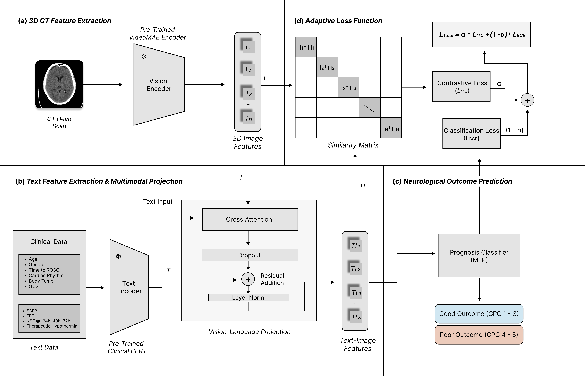
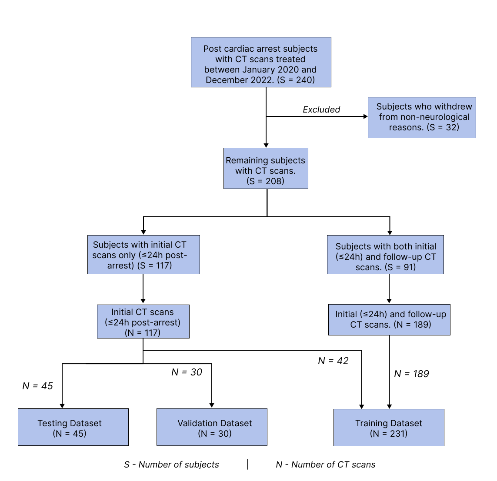
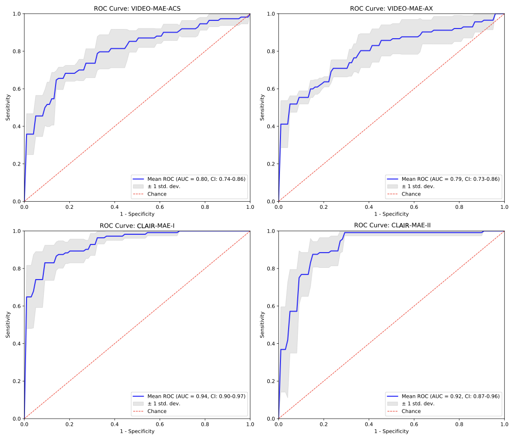

# CLAIR — Contrastive Language and Image Reasoning with Masked Autoencoders

> **Multimodal Contrastive Prognostication Framework for Early Neurological Outcome Prediction in Post-Cardiac Arrest Patients**

[](LICENSE)
[](https://www.python.org/)
[](https://pytorch.org/)
[](https://www.nih.gov/)
[](https://www.nature.com/srep/)

> [!NOTE]
> This paper is currently **under review at Scientific Reports**. The training and testing scripts will be made public upon paper acceptance. For more information or collaboration inquiries, please contact the corresponding author: 📧 akasturi@ur.rochester.edu

---

## Overview

Sudden cardiac arrest (SCA) affects over 600,000 individuals annually in the United States, with mortality rates approaching 90%. Current prognostication methods analyze each modality in isolation and delay assessment until 72 hours post-arrest — creating a critical gap in early, informed clinical decision-making.

**CLAIR** addresses this by jointly reasoning over head CT imaging and structured clinical data to predict neurological outcomes **within 24 hours** of cardiac arrest. It integrates:

- A **3D MAE** based vision encoder for 3D spatiotemporal CT feature extraction (axial, coronal, sagittal views)
- A **BioClinicalBERT** text encoder for structured clinical variable encoding
- A **cross-attention decoder** that fuses imaging and clinical features bidirectionally
- An **adaptive hybrid loss** combining image-text contrastive learning and binary cross-entropy

In a retrospective study of 208 post-cardiac arrest patients, CLAIR achieved an **AUC-ROC of 0.94** (95% CI: 0.90–0.97), significantly outperforming CT-only baselines (AUC-ROC: 0.80, p = 0.03). Clinicians assisted by CLAIR also made fewer prognostic errors than in unassisted evaluations.

---

## CLAIR Framework



**Figure 1.** Overview of the CLAIR–MAE multimodal framework.
**(a)** CT volumes are processed by a pre-trained VideoMAE encoder to extract image features **I**.
**(b)** Structured clinical variables are encoded with BioClinicalBERT to obtain text features **T**, which are fused with **I** through stacked cross-attention layers to produce joint embeddings **TI**.
**(c)** An MLP classifier converts the multimodal embeddings into a binary neurological outcome label: Good (CPC 1–3) or Poor (CPC 4–5).
**(d)** An adaptive hybrid loss **L = α·L_ITC + (1−α)·L_BCE** trains the model end-to-end, with α as a learnable balancing parameter.

---

## Patient Cohort



**Figure 2.** Patient selection and data partitioning flowchart. The study included 208 post-cardiac arrest subjects who received 306 CT scans between January 2020 and December 2022. Subjects were stratified based on initial vs. follow-up imaging availability. All 306 scans were split at the patient level into training (N=231, 133 subjects), validation (N=30, 30 subjects), and test sets (N=45, 45 subjects). Validation and test sets comprise exclusively initial CT scans obtained within 24 hours post-arrest (median acquisition time: 3.1 hours).

---

## Results

### Model Performance (5-Fold Cross-Validation, Test Set n=45)

| Model | CT Views | Clinical Data | AUC-ROC | Accuracy | Sensitivity | Specificity | PPV | NPV |
|---|---|---|:---:|:---:|:---:|:---:|:---:|:---:|
| VideoMAE-Ax | Axial | — | 0.79 | 0.72 | 0.82 | 0.64 | 0.70 | 0.79 |
| VideoMAE-ACS | Ax + Cr + Sg | — | 0.80 | 0.73 | 0.75 | 0.70 | 0.72 | 0.75 |
| **CLAIR-I** | Ax + Cr + Sg | Clinical Set I | **0.94** | **0.89** | 0.87 | **0.91** | **0.91** | 0.88 |
| CLAIR-II | Ax + Cr + Sg | Clinical Set II | 0.92 | **0.89** | **0.91** | 0.86 | 0.88 | **0.91** |

**Clinical Set I** — Early data (hours of admission): age, sex, baseline body temperature, initial cardiac rhythm
**Clinical Set II** — Comprehensive hospitalization data: Set I + NSE readings, EEG variables, SSEP variables
**Ax** = axial · **Cr** = coronal · **Sg** = sagittal

> CLAIR-I vs. VideoMAE-ACS: ΔAUC = 0.14, p = 0.031 (one-tailed Wilcoxon signed-rank test)

### ROC Curves



**Figure 3.** Receiver Operating Characteristic (ROC) curves for all four model configurations under 5-fold cross-validation: (a) VideoMAE-ACS (AUC = 0.80, 95% CI: 0.74–0.86), (b) VideoMAE-AX (AUC = 0.79, 95% CI: 0.73–0.86), (c) CLAIR-I (AUC = 0.94, 95% CI: 0.90–0.97), (d) CLAIR-II (AUC = 0.92, 95% CI: 0.87–0.96). Blue curves = mean ROC across folds; gray shading = 95% CI; red dashed = chance level.

### Clinician Comparison (n=20 Cases)

CLAIR was benchmarked against two expert clinicians on a structured evaluation of 20 patients (10 good / 10 poor outcomes):

| Evaluator | Test Conditions | Errors (out of 8 difficult cases) |
|---|---|:---:|
| Clinician I (Neurology Resident) | CT report / radiologist impression + Set I or II | 2–4 |
| Clinician II (Neuro-intensivist) | CT scans + Set I or II | 2–3 |
| **CLAIR** | CT scans + Set I or II | 2–3 |
| Clinician I + CLAIR assistance | CT report + Set II | **2** |
| Clinician II + CLAIR assistance | CT scans + Set II | **2** |

Both clinicians made **fewer errors when assisted by CLAIR**, demonstrating its value as a clinical decision-support tool. CLAIR outperformed both clinicians when using comprehensive clinical data (Set II).

---

## Repository Structure

```
CLAIR/
├── codes/
│   ├── clip3.py          # CLAIR-MAE model definition
│   ├── train4.py         # Training pipeline
│   └── testing_clip.py   # Evaluation & ROC curve generation
├── assets/
│   ├── CLAIR2.png        # Architecture figure
│   ├── roc_curves_all.png
│   └── patient-char2.png
├── tmp/
│   ├── CLAIR-MAE.py      # Earlier model version (archived)
│   └── dataset.py        # Earlier dataset script (archived)
└── README.md
```

### `clip3.py` — Model
Defines the `CLIP_MAE` class: VideoMAE vision encoder, BioClinicalBERT text encoder with LoRA fine-tuning, three stacked cross-attention layers, temporal pooling, MLP classifier, and the adaptive hybrid loss (ITC + BCE with learnable α).
<!-- 
### `train4.py` — Training
`CPCDataset` loads `.mp4` CT video files paired with `.txt` clinical prompts. Training uses AdamW with OneCycleLR scheduling, mixed-precision (AMP), gradient accumulation, and saves best checkpoint by validation AUC. Per-epoch metrics logged to CSV.

### `testing_clip.py` — Evaluation
Loads a trained checkpoint and runs inference on the test set. Computes AUC, accuracy, F1, sensitivity, and specificity. Optimizes the classification threshold via Youden's index and saves the ROC curve figure. -->

---

## Installation

```bash
git clone https://github.com/akast7/CLAIR
cd CLAIR
pip install torch torchvision transformers peft scikit-learn tqdm matplotlib
```

| Package | Purpose |
|---|---|
| `torch`, `torchvision` | Deep learning framework |
| `transformers` | VideoMAE + BioClinicalBERT |
| `peft` | LoRA fine-tuning |
| `scikit-learn` | Metrics (AUC, F1, ROC) |
| `tqdm`, `matplotlib` | Progress bars + plotting |

---

## Usage

### Training

```bash
python codes/train4.py
```

Expected data layout:

```
data/
├── v11/
│   ├── train/
│   │   ├── 0/            ← good outcome (CPC 1–3)
│   │   │   └── scan_<RIS>.mp4
│   │   └── 1/            ← poor outcome (CPC 4–5)
│   │       └── scan_<RIS>.mp4
│   ├── val/
│   └── test/
└── prompt1_day_all/
    └── <RIS>.txt         ← structured clinical text prompt
```

### Evaluation

```bash
python codes/testing_clip.py
```

Set the `check_pt` path in `testing_clip.py` to your trained `.pth` checkpoint. Outputs threshold-optimized metrics and saves an ROC curve figure.

---

## Dataset

Single-center retrospective cohort from Strong Memorial Hospital, URMC (Jan 2020 – Dec 2022). IRB approval: RSRB 00004678.

| Split | Patients | CT Scans | CT Window |
|---|:---:|:---:|---|
| Train | 133 | 231 | All time points |
| Validation | 30 | 30 | ≤ 24h post-arrest only |
| Test | 45 | 45 | ≤ 24h post-arrest only |

- 208 total patients · 70 good outcomes (CPC 1–3) · 138 poor outcomes (CPC 4–5)
- Median CT acquisition time: **3.1 hours** post-ROSC
- Non-contrast CT, Philips iCT 256, 2.5 mm slice thickness · axial, sagittal, coronal reconstructions
- Outcomes scored by CPC scale, dichotomized to good (CPC 1–3) or poor (CPC 4–5)

> **Data availability:** De-identified data are available from the corresponding author (I.R. Khan) upon reasonable request, subject to institutional approvals and data use agreements.

---

## Authors

Akhil Kasturi<sup>1,\*</sup>, Ashley R. Proctor<sup>2</sup>, Ali Vosoughi<sup>1</sup>, Chloe T. Zhang<sup>3</sup>, Nathan Hadjiyski<sup>4</sup>, Sydney V. Palka<sup>2</sup>, Jenna Gonillo Davis<sup>2</sup>, Lisa M. Cardamone<sup>5</sup>, Samantha Helmy<sup>6</sup>, Jeronimo Cardona<sup>6</sup>, Thomas W. Johnson<sup>2</sup>, Yang Gu<sup>7</sup>, Mark A. Marinescu<sup>8</sup>, Olga Selioutski<sup>2,9</sup>, Regine Choe<sup>1,3</sup>, Imad R. Khan<sup>2,10,‡,\*</sup>, Axel Wismüller<sup>1,3,11,12,‡</sup>

<sup>1</sup> ECE, University of Rochester · <sup>2</sup> Neurology, URMC · <sup>3</sup> BME, University of Rochester · <sup>4</sup> CS, University of Rochester · <sup>5</sup> Pulmonary Critical Care, URMC · <sup>6</sup> School of Medicine & Dentistry, URMC · <sup>7</sup> Anesthesiology, URMC · <sup>8</sup> Medicine, URMC · <sup>9</sup> Neurology, Stony Brook University · <sup>10</sup> Neurology, UC Irvine · <sup>11</sup> Imaging Sciences, University of Rochester · <sup>12</sup> Faculty of Medicine & Clinical Radiology, LMU Munich

---

## Contact

For questions, collaborations, or access to training and evaluation scripts, please reach out to the co-corresponding author:

**Akhil Kasturi** — PhD Candidate, University of Rochester
📧 [akasturi@ur.rochester.edu](mailto:akasturi@ur.rochester.edu)

---

## Funding

Supported by the National Institutes of Health under Award Number **R01NS131967** (Non-invasive multi-modal neuromonitoring in adults undergoing ECMO; PIs: R. Choe and I.R. Khan). We thank the CIDUR team at URMC for support with imaging and clinical data acquisition.

---

## Citation

```bibtex
@misc{kasturi2025clair,
  title        = {CLAIR: Multimodal Contrastive Prognostication Framework for Early
                  Neurological Outcome Prediction in Post-Cardiac Arrest Patients},
  author       = {Kasturi, Akhil and Proctor, Ashley R. and Vosoughi, Ali and
                  Zhang, Chloe T. and Hadjiyski, Nathan and Palka, Sydney V. and
                  Davis, Jenna Gonillo and Cardamone, Lisa M. and Helmy, Samantha and
                  Cardona, Jeronimo and Johnson, Thomas W. and Gu, Yang and
                  Marinescu, Mark A. and Selioutski, Olga and Choe, Regine and
                  Khan, Imad R. and Wismuller, Axel},
  year         = {2025},
  howpublished = {\url{https://github.com/akast7/CLAIR}},
  note         = {GitHub repository}
}
```
